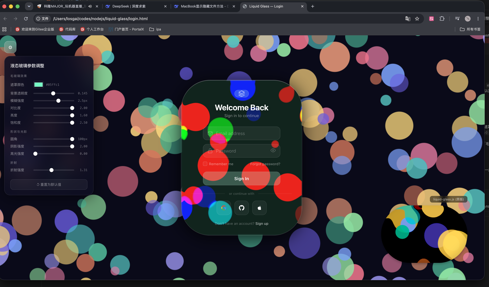

# 🫧 Liquid Glass — Login Page Demo

A stunning **Liquid Glass** login page demo built with SVG filter-based glass morphism effects. Featuring real-time animated backgrounds with colorful floating dots, glass-style UI cards, and a live settings panel for dynamic parameter adjustments.

Based on [shuding/liquid-glass](https://github.com/shuding/liquid-glass) — an open-source SVG shader library for liquid glass effects.



## ✨ Features

- **🫧 Liquid Glass Effect** — Realistic glass morphism powered by SVG filters with refraction, specular highlights, and shadow casting
- **🎨 Dynamic Animated Background** — Colorful floating dots with mouse interaction and parallax movement
- **⚙️ Live Settings Panel** — Adjust glass appearance parameters in real-time:
  - Border width, color, and opacity
  - Glass blur intensity and brightness
  - Refraction and specular highlight strength
  - Shadow parameters
  - Background color picker
- **🪟 Glass Card Layout** — Login form wrapped in a beautiful liquid glass container with smooth entry animations
- **📱 Responsive Design** — Adapts to different screen sizes with centered layout
- **🚀 Zero Dependencies** — Pure HTML/CSS/JS, no build tools or frameworks required

## 🚀 Quick Start

1. **Clone the repository**

   ```bash
   git clone https://github.com/shuding/liquid-glass.git
   cd liquid-glass
   ```

2. **Open the demo**

   Simply open `login.html` in your browser:

   ```bash
   open login.html
   ```

   Or serve it with any static file server:

   ```bash
   npx serve .
   ```

## 📂 Project Structure

```
liquid-glass/
├── login.html          # Login page demo with glass card UI
├── liquid-glass.js     # Core liquid glass effect (SVG filter-based)
├── liquid-diamond.js   # Diamond variant of the glass effect
├── preview.png         # Screenshot preview
└── README.md
```

## 🎮 Usage

### As a Demo

Open `login.html` to see the liquid glass login page in action. Use the **settings panel** on the left to tweak glass parameters in real-time.

### As a Library

You can also use `liquid-glass.js` standalone — paste the script content into any website's browser console to apply the liquid glass effect to the current page:

```js
// Copy and paste liquid-glass.js into the browser console
```

## 🛠️ Customization

The settings panel exposes the following adjustable parameters:

| Parameter | Description |
|-----------|-------------|
| Border Width | Width of the glass card border |
| Border Color | Color of the glass border |
| Border Opacity | Transparency of the border |
| Glass Blur | Blur intensity of the glass effect |
| Glass Brightness | Brightness level of the glass surface |
| Refraction | Strength of the light refraction |
| Specular | Intensity of specular highlights |
| Shadow | Drop shadow parameters |
| Background | Background color of the page |

## 📄 License

MIT License — see [LICENSE](LICENSE) for details.

## 🙏 Credits & Acknowledgements

This project is built upon the incredible open-source work by **[Shu Ding](https://github.com/shuding)**:

- **[shuding/liquid-glass](https://github.com/shuding/liquid-glass)** — The core liquid glass effect library using SVG filters, which powers the glass morphism visuals in this project.
- **[shuding/svg-shaders](https://github.com/shuding/svg-shaders)** — The underlying SVG shader technology that makes the liquid glass refraction and specular effects possible.

If you like this demo, please be sure to check out and ⭐ the original repositories above. Special thanks to Shu Ding for open-sourcing such a beautiful and innovative effect!

> 💬 Have ideas or feedback? Feel free to open an [Issue](https://github.com/shuding/liquid-glass/issues) on the original project.
